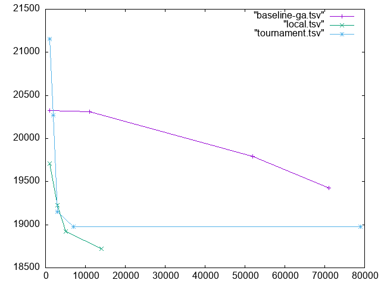

# HW 11 Travelling Salesperson Project (pt3)

`baseline-ga.tsv` is from pt2 of project.

## Class ClimbChromosome

- [x] Override `mutate()`: "local hill climbing" mutation, searches for best solution in a small local "neighborhood"
- [x] Override `clone()`
- [x] assert `is_valid` where prudent

- [x] modify `deme.cpp` to use ClimbChromosome instead of Chromosome
- [x] compile tsp
- [x] experiment w mutrate
- [x] save results into `local.tsv` to obtain baseline

- [x] Copied `local.tsv` from `cmake-build-debug/` to root.

## Class TournamentDeme

inherits from deme class

* Tournament Selection: pits candidate parents against each other to det which parent gets to recombine

  * Select `P` parents at random (`P` is some const pwr of 2 that u choose, no bigger than pop size)

  * take first pair in the set of `P` parents and discard the parent w the lower fitness of the two
  * do same for next pair, etc
  * should have `P/2` resulting parents
  * repeat until 1 parent
* [x] modify `select_parent()` to do the above
* [x] modify `tsp.cc` use TournamentDeme class instead of Deme
* [x] experiment w size to get good results
* [x] test if `Chromosome` or `ClimbChromosome`gives better results
  * [x] `./HW11 challenge.tsv 100 0.2` ClimbChromosome (slightly) better
    * [ ] ClimbChromosome: 18287.2, 17549.6, 18810.3
    * [ ] Chromosome: 18393.4, 18463.1, 18264.8

* [x] save results to "tournament.tsv"
  * [ ] `./HW11 challenge.tsv 1000 0.2 > tournament.tsv`

* [x] copy `tournament.tsv` to root

## Valgrind + Final Checks

`valgrind --leak-check=full --show-leak-kinds=all --track-origins=yes --verbose --log-file=valgrind-out.txt ./HW11 challenge.tsv 100 0.2`

- [x] copy valgrind-out.txt to root

- [x] look over obsidian checkoff list 

## Reporting

Combined graph from “baseline-ga.tsv”, “local.tsv”, and “tournament.tsv”. 

Save the graph into “comparison.gif” 

`gnuplot`

`plot "baseline-ga.tsv" w lp, "local.tsv" w lp, "tournament.tsv" w lp`

`set term gif`

`set out "comparison.gif"`

`replot`

## Extra Credit

submit separately (make new folder)
